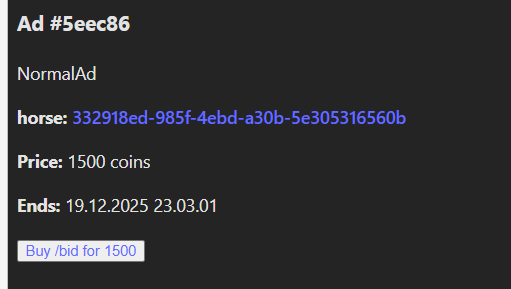
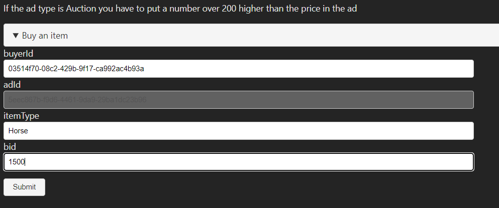
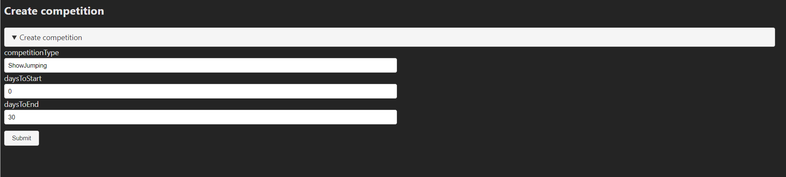
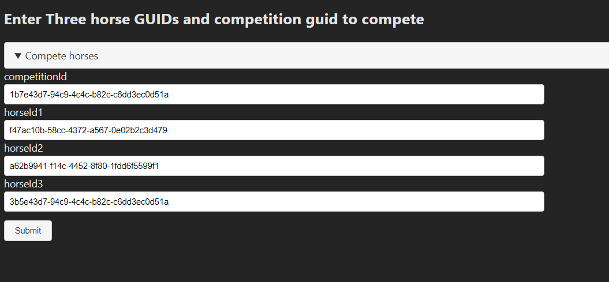

## About the application

Game application where you can buy horses and alpacas and sell them

Net backend: uses FluentValidation, Generic Controller, for deleting, adding, editing Items and fetching paginated list
Animal baseclass for Alpaca and Horse

## 1 Register and log in
Start by going to the homepage, register and then log in. You need a strong password and unique username. (There was a problem with the net login endpoints, so basically it just creates a user for you.)

## Create a random horse and alpaca

## Upload an image

## Update horse 

## Update alpaca

## Delete horse, delete alpaca

## Sell horse / alpaca

You can sell horses or alpacas that you own, that are not already for sale. Go to your horses pick an id and paste to form. You get your userId from the bar below navigation. The ItemType needs to be Horse or Alpaca, depending on which animal you are selling. 

## Buy horse / alpaca

Then you can buy the animal you just bought click Buy/bid link. Then fill out the form with correct price and ItemType. If the ad was NOT an auction, it should disappear from the list.

## Create competition

Go to competitions page, click link create new competition, then fill out the form

## Update competition

## Compete horses

Go to competitions, pick the competition and paste 3 horse ids in the fields (you don't have to own horses). Send the same form 3x times, to get better leaderboard results.

## Check the competition LeaderBoard

Check the horse Guids to show up on the leaderboard

