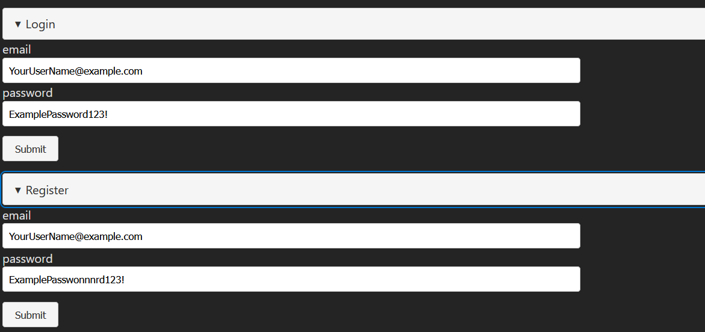

## About application

Game application where you can buy horses and alpacas and sell them

Net backend: uses FluentValidation, Generic Controller, for deleting, adding, editing Items and fetching paginated list7
Animal baseclass for Alpaca and Horse  

## 1 Register and log in
Start by going to the homepage, register and then log in. You need a strong password and unique username. (There was a problem with the net login endpoints, so basically it just creates a user for you.)

## Create a random horse and alpaca

## Upload an image

