## About the application

Game application where you can buy horses and alpacas and sell them

Net backend: uses FluentValidation, Generic Controller, for deleting, adding, editing Items and fetching paginated list
Animal baseclass for Alpaca and Horse

## Register and log in
Start by going to the homepage, register and then log in. You need a strong password and unique username. (There was a problem with the net login endpoints, so basically it just creates a user for you.)

## Create horse / create alpaca

Go to your alpacas and create an alpaca. Same for horses. 
 - Allowed alpaca breeds:         
        Unknown,
        Huacaya,
        Suri
- Allowed horse breeds:
    Unknown,
    Arabian,
    Thoroughbred,
    QuarterHorse,
    Andalusian,
    Appaloosa,
    Mustang,
    Friesian,
    Hanoverian,
    Clydesdale,
    Shire,
    Belgian,
    Percheron,
    Paint,
    ShetlandPony,
    WelshPony,
    Icelandic,
    Fjord,
    AkhalTeke,
    Lusitano,
    Finnhorse

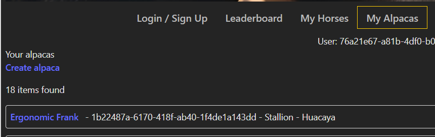

## Breed horses and alpacas

The animals need to be over 3 years old, they don't need to be the same breed, and the user doesn't need to own the animals in question. The owner of the foal will the same as the owner of mare.
Covering can just randomly fail, and then the user gets an error "natural failure". Then just retry. To see the foal, choose the mare or stallion, and go to the foals tab.

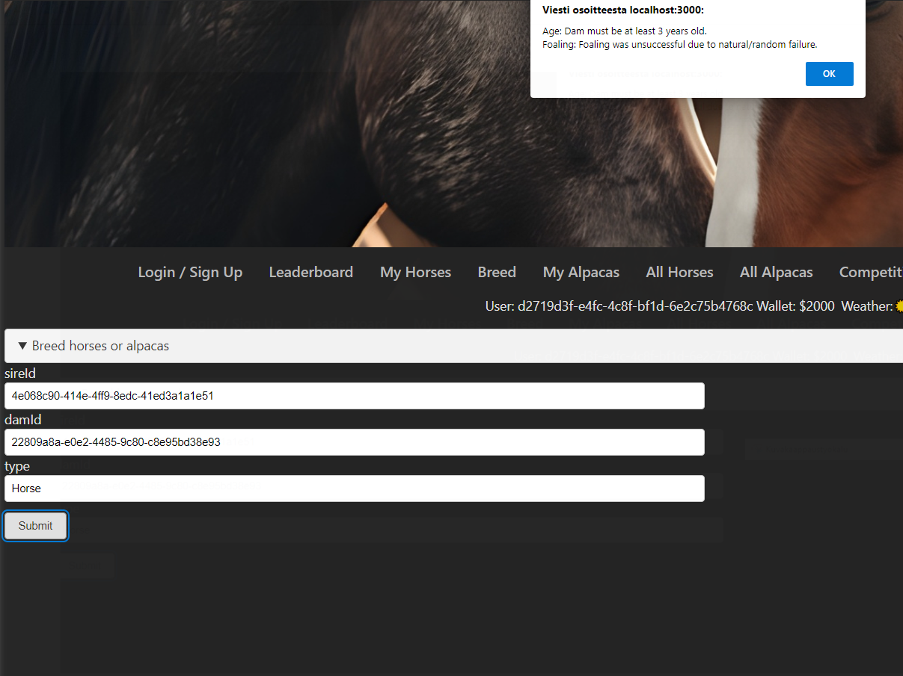

Horses have filters, alpacas have the backend filter but not implemented in the front end.

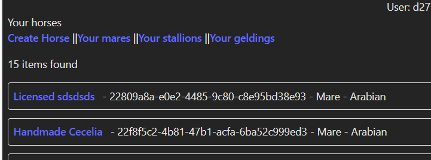

## Change image for a horse

Go to images page, and copy url of an image, go back to horse individual page and update the imageUrl

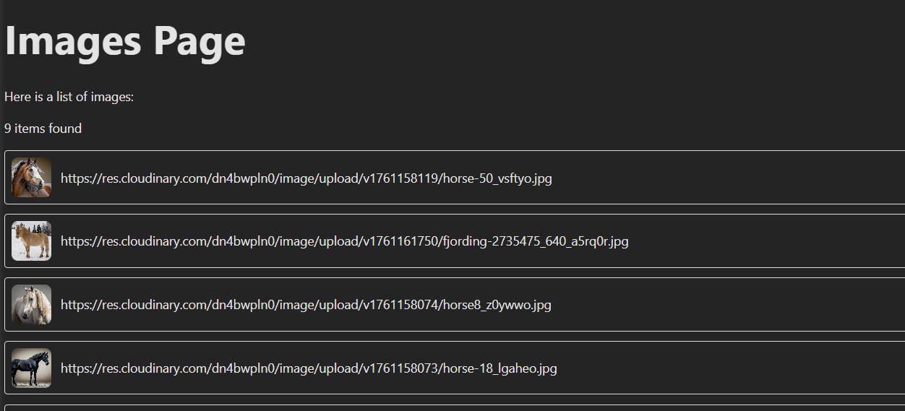
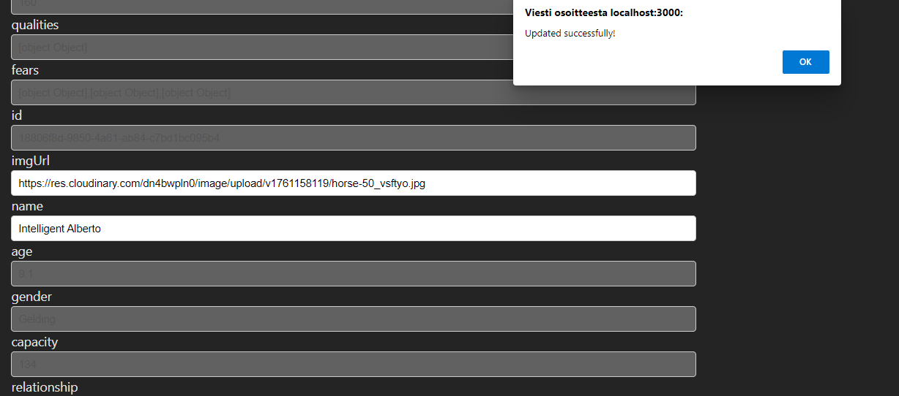

## Clean the stable

Click the link Clean Stable in the navigation, and then click the button to clean the stable. Do you get some money for doing it? No. Maybe you get some good karma, who knows? 

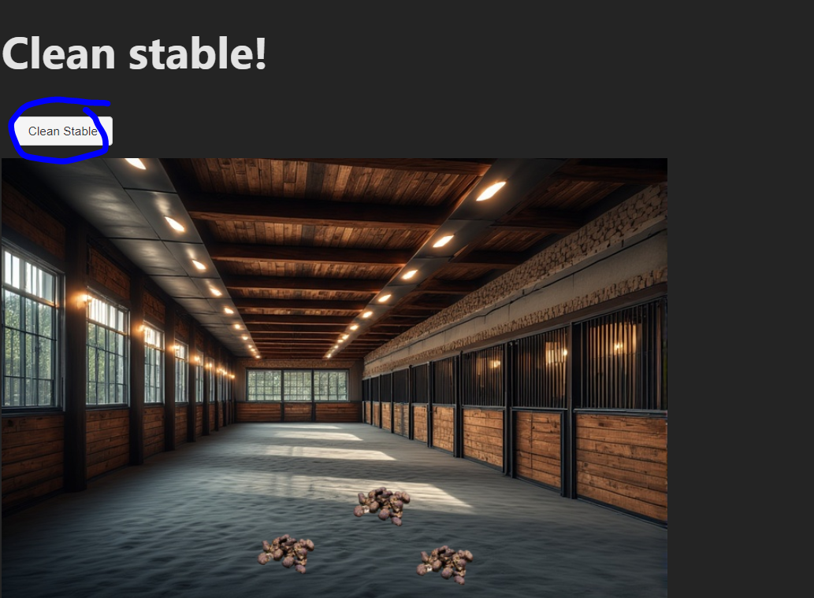

## Update horse/alpaca information

Go to an alpaca's page, select the Update tab, and update a field of your choice. The serverside validation let's you know if the data you input is valid. Horses have less field's that can be updated. If the fields are null, like for images, the form submits the name 2 times instead, so don't leave empty fields as the form does not handle them gracefully. 

## Sell horse / alpaca

You can sell horses or alpacas that you own, that are not already for sale. Go to your horses pick an id and paste to form. You get your userId from the bar below navigation. The ItemType needs to be Horse or Alpaca, depending on which animal you are selling. 

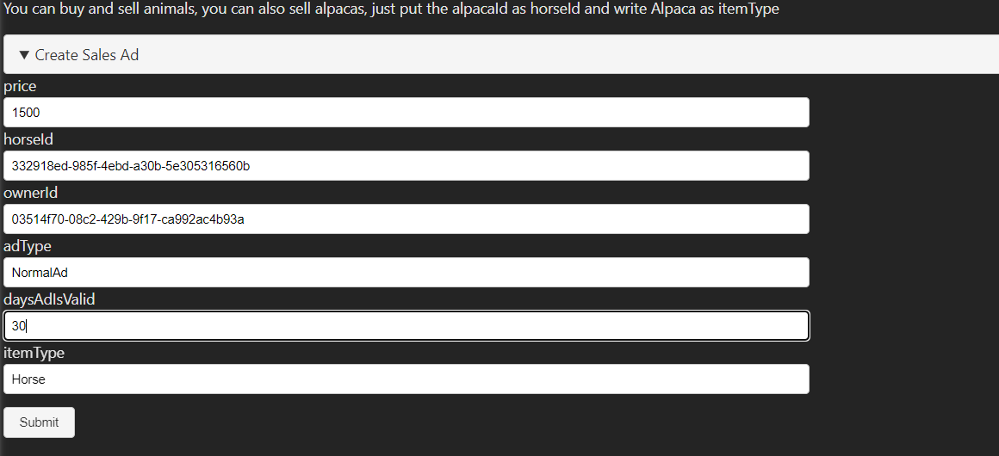

## Buy horse / alpaca

Then you can buy the animal you just bought by clicking the Buy/bid link. Then fill out the form with correct price and ItemType. If the ad was NOT an auction, it should disappear from the list. If the ad is a Auction type, the price is updated to the higher price. In Auctions the bid needs to be 200 higher than the current price of the ad. If the ad is not an auction, the bid amount will be ignored. 

## Create competition

Go to competitions page, click link create new competition, then fill out the form

## Update competition

Choose competition to update, edit the competition and follow the serverside validation guidelines

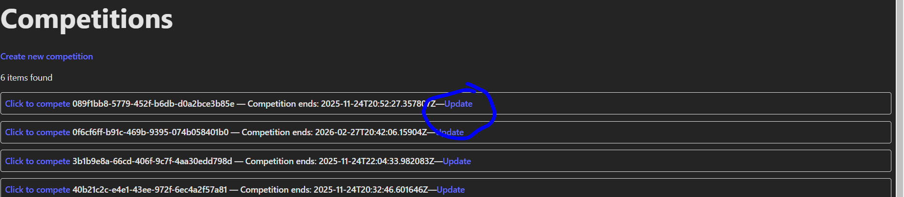

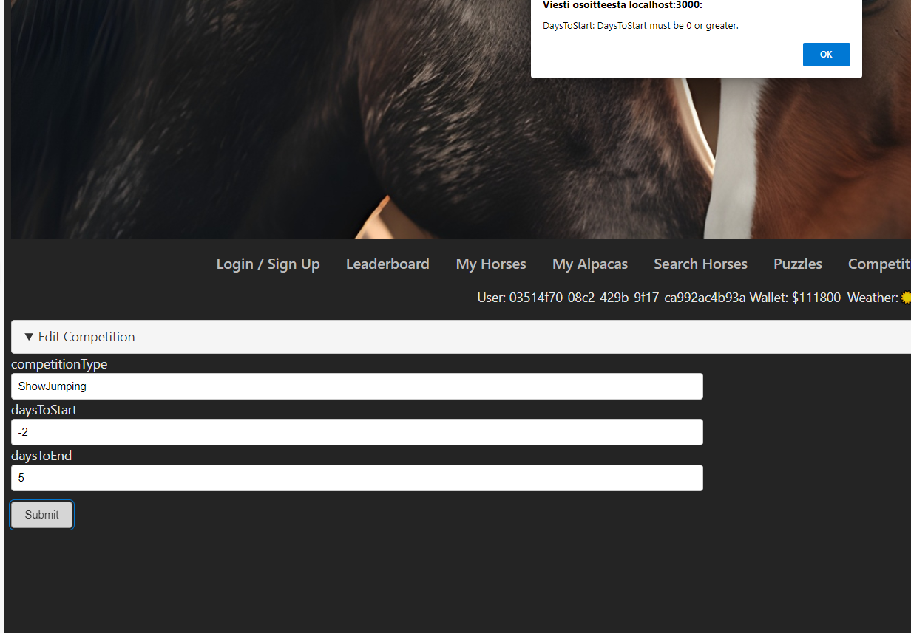

## Compete horses

Go to competitions, pick the competition and paste 3 horse ids in the fields (you don't have to own horses). Send the same form 3x times, to get better leaderboard results. Some error so the validation alert is empty, but the form still works. 

## Check the Results tab in the Horse page

Check the Results tab to see how the competitions went.

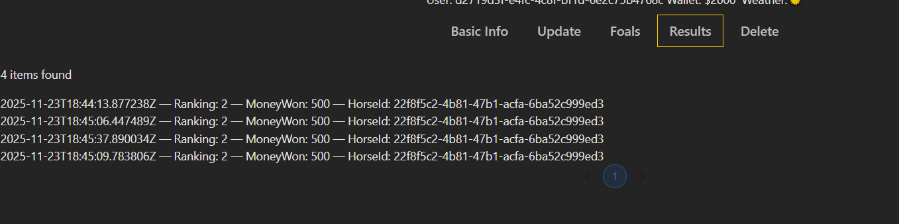

## Check the competition LeaderBoard

Check the horse Guids to show up on the leaderboard

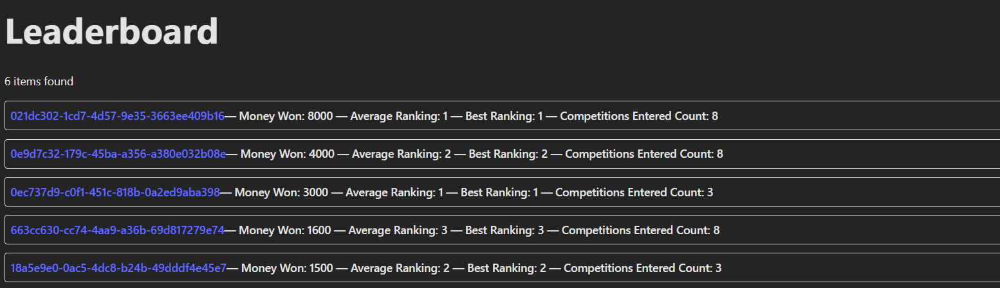

## Delete horse, delete alpaca

Go to an animal's page, click Delete, and then click delete button. There is no cascading delete implemented, so salesads and leaderboard results are shown even though the animal has been deleted. Therefore, it is recommended to do the deletions as a last step.

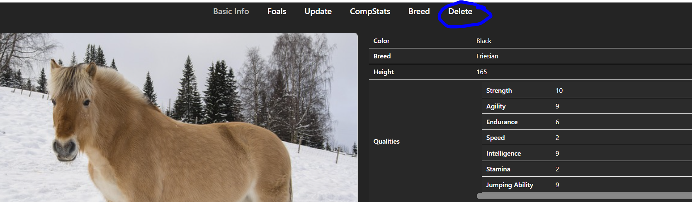

## Delete competition

Click competitions and pick an competition to delete

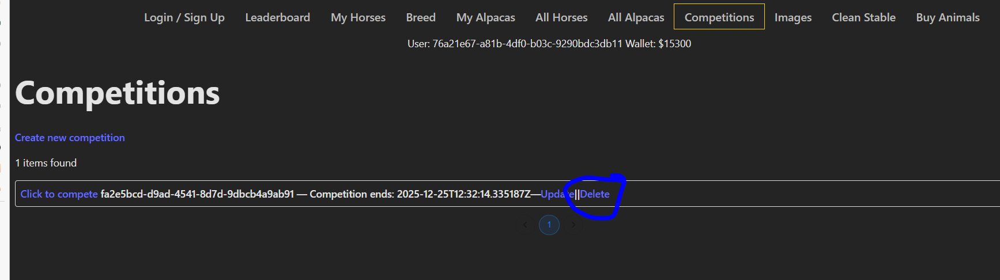

## Delete salesad

Click buyhorses and pick an competition to delete

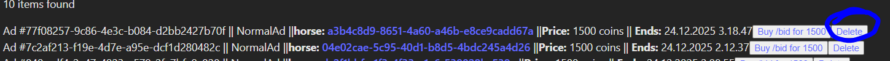

## There is an image upload in swagger that works, not implemented in frontend, and a lot of other functions unfortunately

You can check that in swagger, and then you get the image url you can update on a horse. Image size is restricted and validated upon upload.

!IMPORTANT: NO WAY FOR A USER TO DELETE IMAGES, SO UPLOAD CAREFULLY

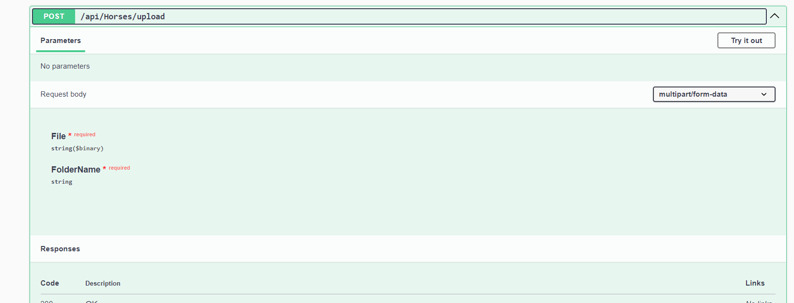

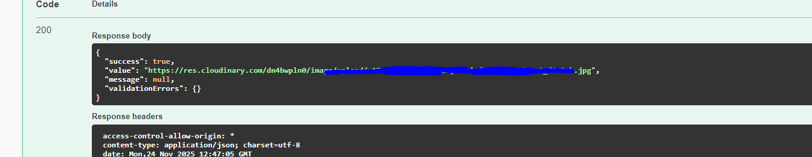